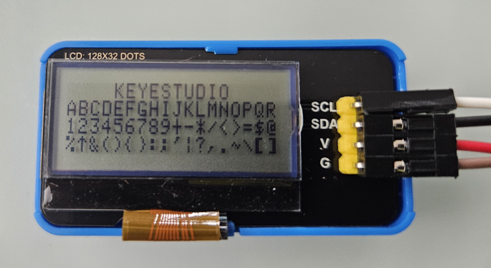
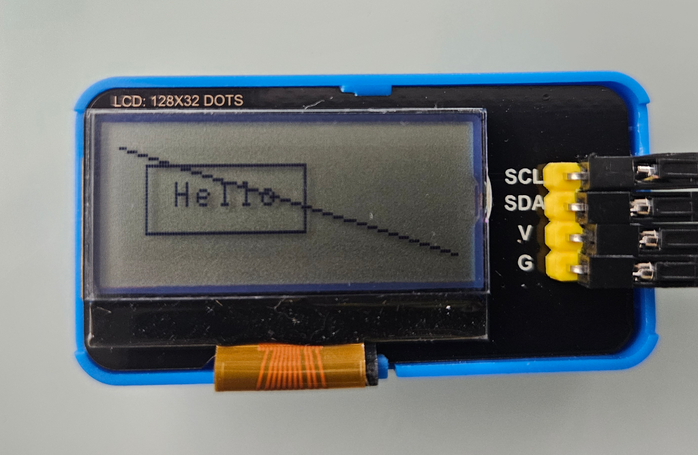
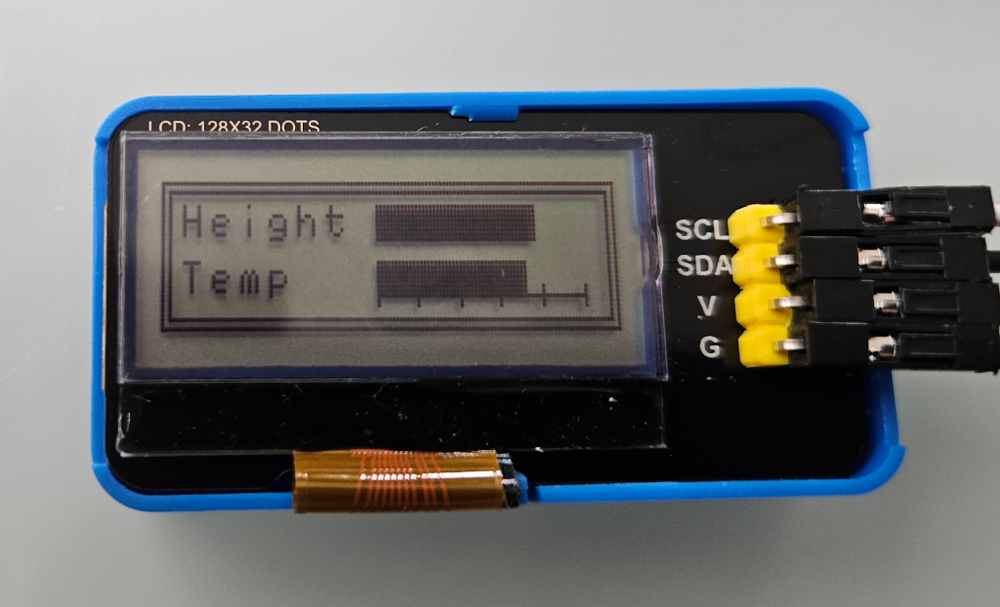
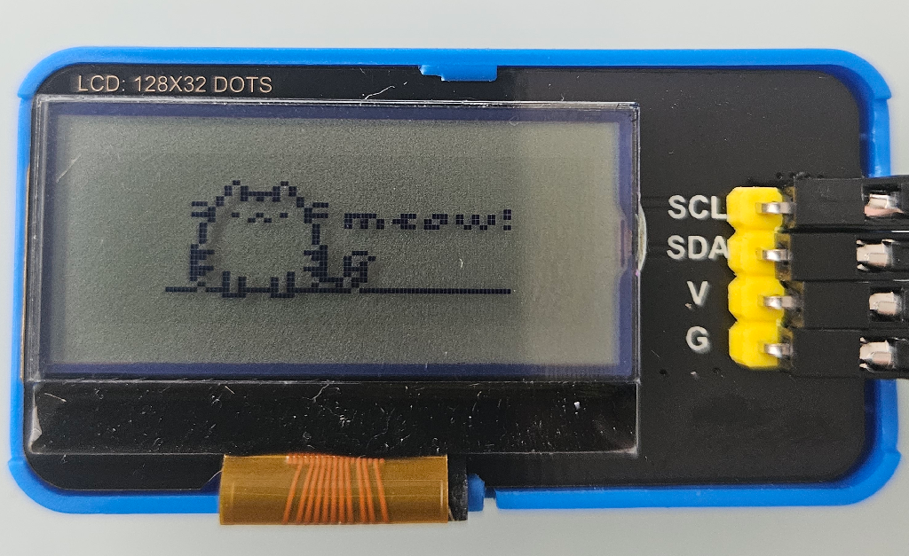

**Circuit Python Drivers for the Keyestudio 128x32 i2c LCD module**

The module uses an ST7565 controller, with an I2C adapter.
It should work with similar displays.

***Files***

- `lcd_128_32.py` - character only library. 
- `lcd_128_32_graphics.py` - characters and graphics library using a framebuffer.

Both libraries require the `lcd128_32_font.py` file.

***Installation***

Copy all three files to your CIRCUITPY drive.

(`lcd_128_32.py`, `lcd_128_32_graphics.py` and `lcd128_32_font.py`)

You can omit `lcd_128_32_graphics.py` if you don't want to draw graphics.

***Examples***

- `examples/characters.py` - basic text demo
- `examples/graphics.py` - basic graphics demo
- `examples/drawing_demo.py` - animated graphics demo
- `examples/draw_cat_bitmap.py` - displays a cat bitmap image. Conversion tools are in `/tools`

***Screenshots***

